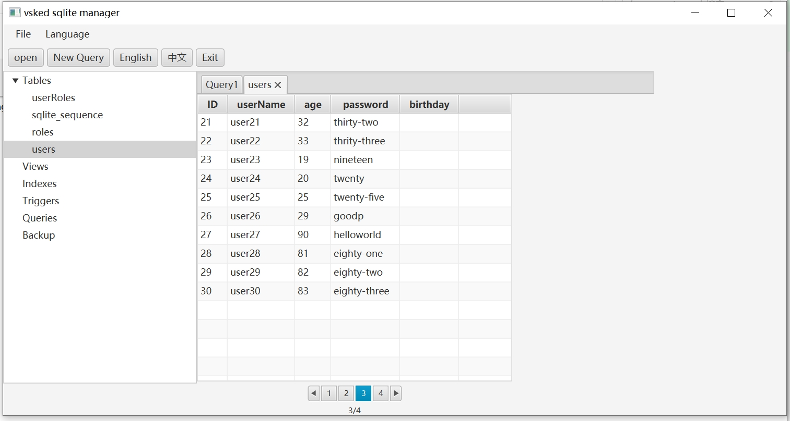
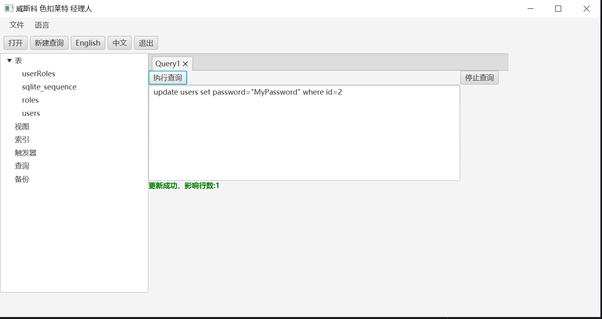

# this tool only support sqlite database
## support Multi-Language
## use javaFx build user interface

### techlogy used
#### java 21.0.6
#### log4j2 2.19.0
#### testng 7.7.1
#### javaFX 23.0.2
#### sqlite driver 3.49.0.0

this is a sqlite manager application  
I write it by java Language  
If you have any question submit issue  
you can see current UI in screenshot folder  

future plan:  
1. support multi-language ok
2. show tables use tree view ok
3. add table ok
4. edit table ok
5. remove table ok
6. generate test data todo
7. table column add notes todo
8. edit table column ok
9. show table data with page ok
10. execute select sql ok
11. execute insert or update or delete sql ok
12. show views todo
13. show triggers todo
14. show indexes todo
15. save query todo
16. backup database todo
17. when table data is empty show empty table bug fix todo

# screen shoot
## edit table

## query result

## table data list

## update success

## TODO
add unit test for every method

## sqlite query

SELECT name FROM sqlite_master WHERE type='table'

WITH all_tables AS (SELECT name FROM sqlite_master WHERE type = 'table')
SELECT at.name table_name, pti.*
FROM all_tables at INNER JOIN pragma_table_info(at.name) pti
ORDER BY table_name;

select * from pragma_table_info('users')

select * from pragma_table_info('userRoles')

SELECT *
FROM sqlite_master
WHERE type='table' AND sql LIKE '%FOREIGN KEY%';